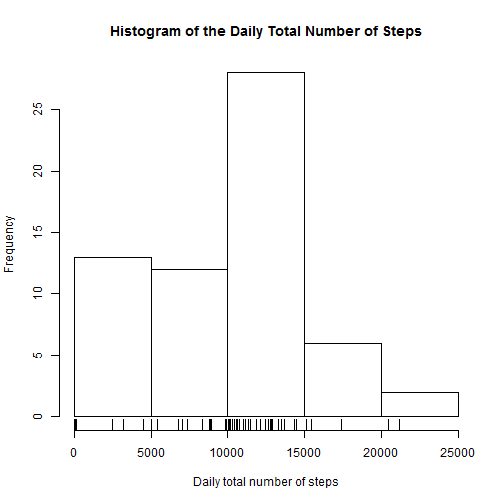
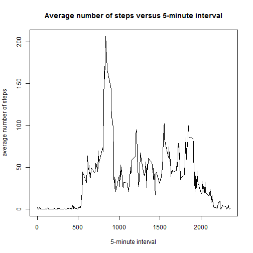
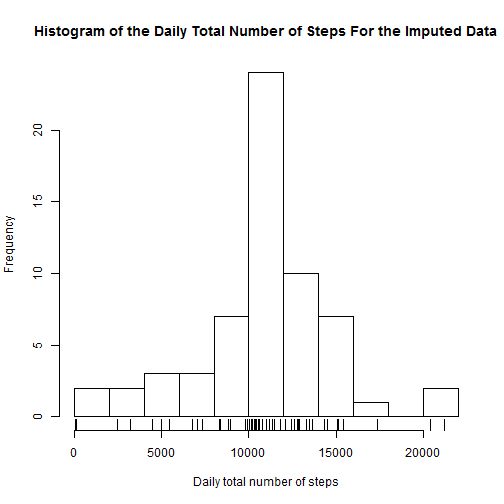
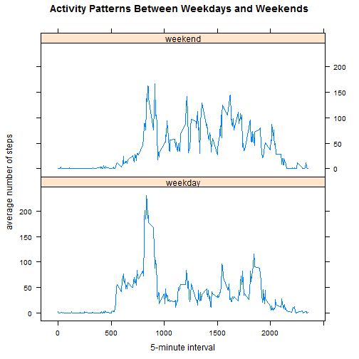

# Reproducible Research: Peer Assessment 1


## Loading and preprocessing the data

The data is to be loaded and pre-processed.


```r
library(data.table) # load the package "data.table"
data <- fread("activity.csv", data.table = FALSE) # read in the data
```

## What is mean total number of steps taken per day?

The total number of steps taken daily is to be calculated. Then, the histogram
for the daily total number of steps throughout two months is plotted.


```r
library(dplyr) # load the package "dplyr"
step_number_df <- data %>%
      group_by(date) %>% # group data by date
      # get daily total number of steps 
      summarise(total_step_number = sum(steps, na.rm = TRUE)) %>%
      as.data.frame() # convert tibble to data frame
x_label <- "Daily total number of steps"
the_title <- "Histogram of the Daily Total Number of Steps"
# the array for the daily total number of steps
step_array <- step_number_df$total_step_number
# mean of the daily total number of steps
the_mean <- as.integer(round(mean(step_array)))  
# median of the daily total number of steps
the_median <- as.integer(round(median(step_array)))
# draw the histogram
hist(step_array, xlab = x_label, main = the_title, breaks = "FD")
# lay the daily total number of step values under the histogram
rug(step_array)
```



The mean of the daily total number of steps is 9354 and its median is 
10395.

## What is the average daily activity pattern?

The activity pattern, i.e. the number of steps taken, with respect to the 
5-minute interval is to be averaged across all days.


```r
avg_daily_act <- data %>% group_by(interval) %>% # group by interval
      # get average number of steps
      summarise(avg_steps = mean(steps, na.rm = TRUE)) %>%
      as.data.frame() # convert tibble to data frame
# the index for the maximum average number of steps
max_index <- which.max(avg_daily_act$avg_steps)
# the 5-minute interval at which the maximum number of average steps occurs
max_avg_step <- avg_daily_act$interval[max_index]
x_label <- "5-minute interval"
y_label <- "average number of steps"
the_title <- "Average number of steps versus 5-minute interval"
with(avg_daily_act, plot(interval, avg_steps, type = "l", xlab = x_label, 
                         ylab = y_label, main = the_title))
```



The maximum average number of steps occurs at the 5-minute interval 
835.

## Imputing missing values

There are missing values in the data set and these missing values will be filled 
in.


```r
num_miss_values <- sum(is.na(data$steps)) # number of missing values
```

The total number of missing values in the data set is 2304. For 
filling in the missing values, the mean for that 5-minute interval across all 
days is to be used.


```r
# combine the original data and the average daily activity data on the
# "interval" key.
filled_data <- full_join(data, avg_daily_act, by = "interval")
filled_data <- filled_data %>%
      # replace NA with the average value
      mutate(steps = ifelse(is.na(steps), avg_steps, steps)) %>%
      # keep "date", "interval" and "steps" columns
      select(date, interval, steps) %>%
      as.data.frame() # convert tibble to data frame
step_number_filled_df <- filled_data %>%
      group_by(date) %>% # group data by date
      # get daily total number of steps 
      summarise(total_step_number = sum(steps)) %>%
      as.data.frame() # convert tibble to data frame
x_label <- "Daily total number of steps"
the_title <- "Histogram of the Daily Total Number of Steps For the Imputed Data"
# the array for the daily total number of steps
step_array_filled <- step_number_filled_df$total_step_number
# mean of the daily total number of steps
the_mean_filled <- as.integer(round(mean(step_array_filled)))  
# median of the daily total number of steps
the_median_filled <- as.integer(round(median(step_array_filled)))
# the change in the mean
change_mean <- round(100 * (the_mean_filled - the_mean) / the_mean, 2)
# the change in the median
change_median <- round(100 * (the_median_filled - the_median) / the_median, 2)
# draw the histogram
hist(step_array_filled, xlab = x_label, main = the_title, breaks = "FD")
# lay the daily total number of step values under the histogram
rug(step_array_filled)
```



The mean of the daily total number of steps for the imputed data set is 
10766 and its median is 10766. Before imputation,
the mean was 9354 and the median was 10395. There is a 
%15.1 increase in the mean and %3.57 increase in the median.

## Are there differences in activity patterns between weekdays and weekends?

The activity patterns between weekdays and weekends are expected to differ. This
difference is to be examined.


```r
# obtain posixlt form of the dates as an array
date_array <- as.POSIXlt(filled_data$date)
# 0: sunday, 1: monday, 2: tuesday, 3: wednesday, 4: thursday, 5: friday,
# 6: saturday
week_day_count <- date_array$wday
# the function to get the day type, weekday or weekend
day_type <- function(x){
      ifelse((x <= 5) & (1 <= x), "weekday", "weekend" )
}
# apply day_type function to the week_day_count array
day_type <- sapply(week_day_count, day_type)
# add the day type column to the filled data frame
filled_data$day_type <- day_type
# obtain average weekday activity pattern
avg_weekday_act <- filled_data %>%
      filter(day_type == "weekday") %>% # only weekday data
      group_by(interval) %>% 
      summarise(steps = mean(steps)) %>% # average across all weekdays
      mutate(day_type = "weekday") %>% # add day type
      as.data.frame() # convert tibble to data frame
# obtain average weekend activity pattern
avg_weekend_act <- filled_data %>%
      filter(day_type == "weekend") %>% # only weekend data
      group_by(interval) %>%
      summarise(steps = mean(steps)) %>% # average across all weekends
      mutate(day_type = "weekend") %>% # add day type
      as.data.frame() # convert tibble to data frame
# collect weekend and weekday data in a data frame
weekend_weekdays <- bind_rows(avg_weekday_act, avg_weekend_act)
# convert day_type column to factor
weekend_weekdays$day_type <- as.factor(weekend_weekdays$day_type)
library(lattice) # load lattice package
x_label <- "5-minute interval"
y_label <- "average number of steps"
the_title <- "Activity Patterns Between Weekdays and Weekends"
# plot the activity patterns
xyplot(steps ~ interval | day_type, data = weekend_weekdays, type = "l",
       layout = c(1, 2), main = the_title, xlab = x_label, ylab = y_label) 
```



As can be seen from the panel plot, the weekends pattern and the weekdays pattern
differ from each other.
